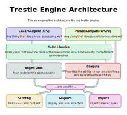

# Engine architecture



## Subsystem communication

In Trestle, subsystems are split into individual systems.

That is nice until you realise that these subsystems now need to communicate with eachother - or at minium, share a scene graph. How will we do it? Well, here is an idea...

Each subsystem could be defined like this:

```cpp
struct Subsystem:
	typename localvar1
	typename localvar2
	...

TrSubsystemInit(Subsystem *this, Scene *scene)
...
```

With the scene being able to hold objects, variables and other "game global" things.